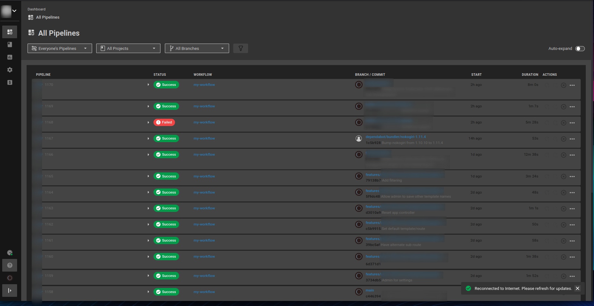
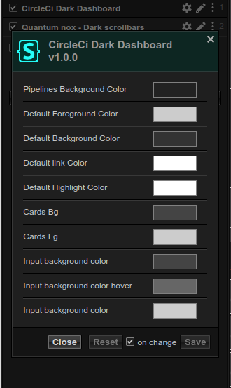

# Dark CircleCi Dark Theme for Dashboard/Pipelines
Dark CircleCi Dashboard Theme Userstyle

(Other people might call this: Dark mode, Night mode, Night theme, Eye care).

# Installation instructions
1. Install [Stylus for Firefox](https://addons.mozilla.org/en-US/firefox/addon/styl-us/), [Chrome](https://chrome.google.com/webstore/detail/stylus/clngdbkpkpeebahjckkjfobafhncgmne), [Opera](https://addons.opera.com/en-gb/extensions/details/stylus/) or [Cascadea for Safari](https://cascadea.app/).
2. Click here 

# Why?
I believe that we should be able to change any background we want from any website we want. 
I consider night mode a fundamental feature that should be provided because it reduces eyestrain and user fatigue. 

# Preview

## Settings

# Check my other style
* Jira Dark Theme - https://github.com/aalvarado/JiraDarkTheme

Thank you for the ⭐s
